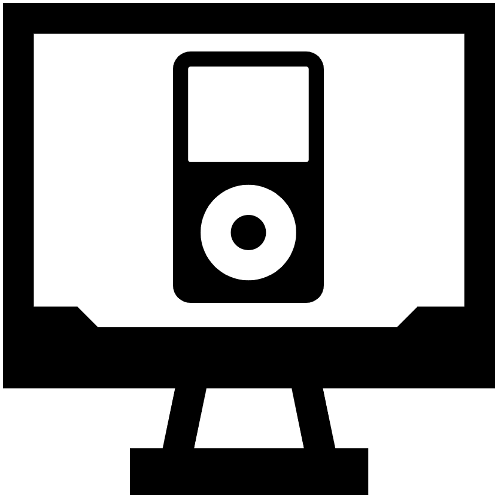

    
    <h1>clicky</h1>
    
A clickwheel iPod emulator.

---

**Current focus:** Getting [Rockbox](https://www.rockbox.org/) up and running on an emulated [iPod 4G (Grayscale)](https://everymac.com/systems/apple/ipod/specs/ipod_4thgen.html).

Here are some clips:

<table>
  <tr>
    <td></td>
    <td></td>
  </tr>
  <tr>
    <td width="320px">Booting <code>ipodloader2</code> (a third-party bootloader for the iPod)</td>
    <td width="320px">Successfully booting into <a href="https://www.rockbox.org/"><code>Rockbox</code></a></td>
  </tr>
</table>

**This project is not ready for general use yet!**

`clicky` is still in it's early stages, and there hasn't been much effort put into making it easy to use.

That said, if you're a cool [hackerman](https://www.youtube.com/watch?v=V4MF2s6MLxY) who can [jam with the console cowboys in cyberspace](https://www.youtube.com/watch?v=BNtcWpY4YLY), check out the [`QUICKSTART.md`](https://github.com/daniel5151/clicky/blob/master/docs/QUICKSTART.md) and/or [`DEVGUIDE.md`](https://github.com/daniel5151/clicky/blob/master/docs/DEVGUIDE.md) for info on how to build `clicky` and start running iPod software!

    Join the Developer Discord!
    

## Call for Contributors!

Up until now, `clicky` has been a one-man hobby project, and while it's been a great way to kill time during my impromptu COVID-induced "staycation" that spanned the months between University graduation and starting full time work, I won't have too much time to dedicate to `clicky` moving forwards.

As such, I'm hoping to find a couple folks out there who might be interested in pushing this project forwards!

I've tried to keep the project as clean and well organized as possible, with plenty of inline comments and documentation. I've also included detailed developer-focused documentation under the `docs` folder.

Additionally, I've kept collected a fairly extensive corpus of iPod documentation / test software which is included in-tree under the `resources` folder.

**If you're interested in emulating an iconic piece of early 2000s pop-culture, don't hesitate to get in touch!**

---

Are you someone with strong **reverse engineering** experience and wants to help preserve an iconic piece of early 2000s pop-culture? If so, read on!

While I expect that I'll be able to get Rockbox and iPodLinux up and running, I worry that getting Apple's RetailOS working may prove difficult. While lots of reverse-engineering work has already been done by the iPodLinux and Rockbox projects back around 2007, it seems that there are still plenty of registers / memory blocks whose purpose is unknown. `clicky` can already boot into RetailOS, and I'm noticing lots of accesses to undocumented parts of the PP5020 memory space.

Fortunately, now that we're living in 2020 (i.e: the future), we have access to newer, better tools that can aid in reverse-engineering the iPod. Free and powerful reverse engineering tools (like [Gridra](https://ghidra-sre.org/)), and emulation software (`clicky` itself) aught to make it easier to inspect and observe the state of the RetailOS binaries while they're being run, and gain insight into what the hardware is supposed to do.

I've got some reverse engineering experience, but truth be told, it's not really my forte, so if you're interested in helping out, please get in touch!

---

## Emulated Hardware

-   MVP: [iPod 4g (Grayscale)](https://everymac.com/systems/apple/ipod/specs/ipod_4thgen.html)
-   End goal: [iPod 5g](https://everymac.com/systems/apple/ipod/specs/ipod_5thgen.html)

Why these models?

The 4g uses the same/similar SOC as some of the later generation models (PP5020), while using a simpler (grayscale) display. This should make it easier to get display emulation up and running, leaving more time to implement other devices.

The 5g is the first iPod model to support [iPod Games](https://en.wikipedia.org/wiki/IPod_game), which are an interesting part of gaming history which have never been preserved!

Theoretically, it wouldn't be too difficult to support all the different generations of iPod models (since they all share roughly the same hardware).

## Roadmap

_Note:_ This roadmap was written fairly early in the project's development, and hasn't been updated in a while. It's still mostly accurate, though in hindsight, it seems to under/overestimate how complicated certain features are to implement.

The plan is to implement devices and hardware "just in time" throughout development, instead of attempting to one-shot the entire SoC right off the bat. As such, the idea is to gradually test more and more complex software in the emulator, implementing more and more hardware as required.

Stage 1 will be to run some basic bootloader software, and get a feel for the hardware:

-   [x] Execute something _really_ basic, such as https://github.com/iPodLinux/ipodloader/
    -   This rough-little bit of software is simple enough to step through and understand fully, making it a great launching off point for the project.
    -   It touches quite a bit of iPod-specific hardware (e.g: Timers, Buttons, LCD)
    -   **Goals:**
        -   Find my footing with the ARM7TDMI CPU, and the iPod's funky dual-processor architecture
        -   Get more familiar with the ARM7TDMI assembler and compiler toolchain
        -   Set up project boilerplate
            -   Memory interconnect framework
            -   LCD output, button input
            -   basic CLI
        -   Scaffold basic system architecture (step through CPU, system memory map, interact with devices)
-   [x] Get through the more complex https://github.com/iPodLinux/ipodloader2/
    -   Touches even _more_ iPod-specific hardware (ATA-2)
    -   Seems to do more in-depth system init (i.e: interrupt handling, memory mapping)
    -   **Goals:**
        -   Expand on the system architecture + implemented devices

Stage 2 will be to running some popular open-source iPod alternative firmwares, such as Rockbox and iPodLinux.
Since these projects are open source, is should be possible to trace through the code, making implementing devices / debugging issues a lot easier.

-   [x] Boot into [Rockbox](https://www.rockbox.org/)
    -   A gargantuan task, one which will involve implementing a _lot_ of misc. hardware
    -   **Goals:**
        -   Boot an actual OS on the iPod
-   [ ] Boot into [iPod Linux](http://www.ipodlinux.org/)
    -   A bigger beast than Rockbox, and likely much more difficult to step through and debug
    -   **Goals:**
        -   Boot _another_ actual OS on the iPod
        -   Fill in the gaps between the hardware Rockbox uses, and the hardware iPod Linux uses

Stage 3 will involve running closed-source Apple software, notably, the original iPod RetailOS:

-   [ ] Boot / pass the Apple Diagnostics program
    -   If you press and hold the Select+Prev while an iPod is booting up, a diagnostics program built directly into the Flash ROM is executed!
    -   This would likely be the first closed source software the emulator runs.
    -   Makes for a great playground to poke at the various hardware features that exist on the iPod, without worrying too much about an OS scheduler getting in the way.
    -   **Goals:**
        -   Run some closed source software
-   [ ] Boot into RetailOS
    -   i.e: _the big money goal_
    -   Hopefully, by getting two other OSs up and running, RetailOS will "just work"
    -   Realistically, those Apple engineers probably did some fancy/janky stuff, and things will be very broken
    -   **Goals:**
        -   Get an actual working emulated iPod up and running!
        -   Play some authentic Brick Breaker!

Once things seem stable, it shouldn't be _too_ difficult to get the iPod 5g up and running, since it's mostly the same hardware, mod the color screen.

### Unknowns that might make things tricky

-   Funky cache effects
    -   I _really_ don't want to deal with implementing proper caching if I don't have to. I'm gonna cross my fingers, and hope that having both CPUs see memory writes at the same time will be _fiiiiine_
-   Funky iPod hardware that _hasn't_ been reverse engineered
    -   ...this will suck, and unfortunately, It's probably something I'll encounter once I start messing around with RetailOS.

### Things probably best left for later

-   USB
    -   This seems like a huge rabbit hole of complexity, and is something that probably isn't critical to the iPod's core functions. Stubbing things out will probably be fine...
-   Audio
    -   inb4 "but it's an iPod, it's literally an _audio player_"
    -   yeah, I know, but Audio is hard and finicky to get right, so I'll be leaving it for _waaaaaay_ later

---

## Fluff: Why emulate the iPod?

'cause it's a neat technical challenge! :smile:

Compared to my last big emulation project ([ANESE](https://prilik.com/ANESE), a NES emulator that [automatically maps out NES games](https://prilik.com/blog/wideNES)), the iPod presents a totally different set of technical challenges to overcome.

First of all, the iPod is a fairly modern system. Unlike the esoteric and custom-made chips used in many game consoles, the iPod uses many off-the-shelf commodity hardware and technologies. As such, this project should be a good way to explore and learn more about the low level details of the ARM architecture, I2S, I2C, USB, IDE HDDs, etc...

Second of all, the iPod isn't very well documented! While this'll probably end up being more annoying than exciting in the long run, I'm excited to do my own research, discover new information, and consolidate information on the iPod myself (as opposed to already having a well organized and complete reference at my disposal \*cough\* the nesdev wiki \*cough\*). As it turns out, there's already quite a amount of documentation about the iPod that's floating around (thanks to the iPodLinux and Rockbox projects), but I'm sure there will still be plenty of stuff left for me to discover. Time to finally learn how to use [Ghidra](https://ghidra-sre.org/) I guess!

Lastly, the iPod is a system that's never been emulated before! That means there usually won't be any sort of "escape hatch" when I get stuck, since there's no one else's code I can peek at. Whatever challenges I run in to will be challenges I'm going to have to solve myself! How exciting!

...there is one last reason I want to emulate the iPod though:

**It's got _Brick Breaker!_**

> _ooooooh Brick Breaker baybeeeeee! This game has won game of the year, I don't know how many times!_

But seriously, aside from brick breaker, there were actually a whole bunch of [iPod Games](https://en.wikipedia.org/wiki/IPod_game) released for late-gen iPod models \~2006. While these games aren't necessarily _masterpieces_, they're still pretty neat, and aught to be preserved.

In fact, my initial inspiration for starting this project was actually hearing about these old games, and how no one has ever looked into preserving them. While getting these games working will probably take quite a while, it's a neat long-term goal to aim for.

## Thanks and Acknowledgments

This project would be dead in the waters without these folks and projects:

-   [The iPod Linux Project](http://www.ipodlinux.org/) - for invaluable iPod reverse engineering work
-   [Rockbox](https://www.rockbox.org/) - for additional iPod reverse engineering work (and preserving _years_ of IRC logs to search through)
-   [QEMU](https://www.qemu.org/) - for insights on how to structure the codebase, and how certain devices aught to work
-   [Sean Purcell](https://github.com/iburinoc/) - for writing the bulk of [armv4t_emu](https://github.com/daniel5151/armv4t_emu)
